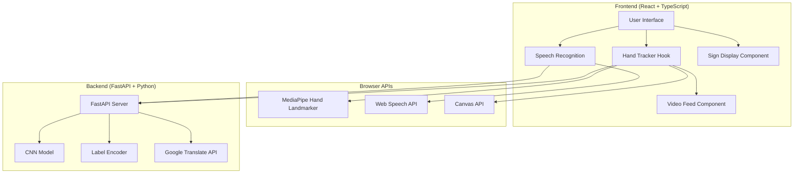

# Design Document

## Overview

The ISHARA bidirectional ISL translation system consists of two primary translation modes operating within a React-based web application. The Sign-to-Text mode uses MediaPipe for hand tracking, a FastAPI backend with a CNN model for gesture classification, and intelligent word segmentation algorithms. The Speech/Text-to-Sign mode uses the Web Speech API for voice input, Google Translate API for multilingual support, and visual ISL alphabet displays.

The system is designed for real-time performance with minimal latency, requiring no special hardware beyond a standard webcam and microphone. The architecture emphasizes browser compatibility, error resilience, and user feedback throughout the translation process.

## Architecture

### High-Level Architecture



### Component Interaction Flow

**Sign-to-Text Flow:**
1. User starts camera → Video stream begins
2. MediaPipe processes frames → Detects hand landmarks (21 per hand)
3. Landmarks normalized and sent to backend → CNN model predicts gesture
4. Predictions stabilized (3/4 frames must match) → Letter added to sequence
5. Word segmentation algorithm processes letter sequence → Forms words
6. Words spoken via speech synthesis → Added to building sentence

**Speech-to-Text-to-Sign Flow:**
1. User speaks → Web Speech API captures audio
2. Speech converted to text in selected language
3. If non-English → Google Translate API translates to English
4. English text processed → Punctuation removed, split into words
5. Words split into letters → ISL alphabet images displayed
6. Images grouped by word with visual separation

## Components and Interfaces

### 1. Hand Tracker Hook (`useHandTracker`)

**Purpose:** Manages the complete lifecycle of hand tracking, gesture recognition, and word building for Sign-to-Text translation.

**State Management:**
```typescript
interface HandTrackerState {
  handLandmarker: HandLandmarker | null;
  rawPrediction: string;
  currentSpelledWord: string;
  buildingSentence: string;
  finalTranslation: string;
  suggestions: string[];
  detectionStatus: string;
}
```

**Key Methods:**
- `startVideo()`: Initializes camera stream and begins frame processing
- `stopVideo()`: Stops camera, finalizes sentence, triggers speech output
- `resetTranslation()`: Clears all state and accumulated text
- `predictWebcam()`: Main animation loop for frame processing
- `sendLandmarksToBackend()`: Sends normalized landmarks to CNN model
- `processSequence()`: Segments letter sequence into words using dynamic programming

**Refs for Performance:**
- `letterSequenceRef`: Stores continuous stream of detected letters
- `predictionStabilityRef`: Tracks last 4 predictions for stabilization
- `lastAddedSignRef`: Prevents duplicate sign detection
- `lastSignTimeRef`: Enforces cooldown between same signs (2000ms)
- `wordTimeoutRef`: Triggers word segmentation after 1500ms of no detection

### 2. MediaPipe Hand Landmarker

**Purpose:** Detects and tracks hand landmarks in real-time from video frames.

**Configuration:**
```typescript
{
  baseOptions: {
    modelAssetPath: "https://storage.googleapis.com/mediapipe-models/...",
    delegate: "GPU"
  },
  runningMode: "VIDEO",
  numHands: 2
}
```

**Output Format:**
- 21 landmarks per hand (42 total for both hands)
- Each landmark: `{x: number, y: number, z: number}`
- Handedness classification: "Left" or "Right"
- Confidence score per hand

**Landmark Processing:**
1. Extract landmarks for left and right hands separately
2. If hand missing, use placeholder (21 zeros)
3. Concatenate: `[left_hand_21_landmarks, right_hand_21_landmarks]`
4. Normalize coordinates relative to wrist (landmark 0)
5. Scale-normalize using max distance from wrist

### 3. CNN Gesture Recognition Model

**Purpose:** Classifies normalized hand landmarks into ISL letters/signs.

**Model Architecture:**
- Input shape: `(1, 42, 2, 1)` - batch, landmarks, coordinates, channel
- Trained on ISL dataset with CNN layers
- Output: Probability distribution over ISL alphabet + signs

**Backend Endpoint:**
```python
POST /predict
Request: {
  "landmarks": [[[x1, y1], [x2, y2], ..., [x42, y42]]]
}
Response: {
  "prediction": "A" | "B" | ... | ""
}
```

**Confidence Threshold:**
- Only predictions with confidence > 0.9 are returned
- Low confidence returns empty string to prevent false positives

**Normalization Function:**
```python
def normalize_and_reshape_for_cnn(landmarks):
    landmarks_np = np.array(landmarks).reshape(42, 2)
    base = landmarks_np[0]  # Wrist position
    centered = landmarks_np - base
    max_value = np.max(np.linalg.norm(centered, axis=1))
    normalized = centered / max_value if max_value > 0 else centered
    return normalized.reshape(42, 2, 1)
```

### 4. Word Segmentation Algorithm

**Purpose:** Converts continuous letter sequences into meaningful words using dynamic programming.

**Algorithm:**
```typescript
function segmentSentence(str: string, dictionary: Set<string>): 
  { sentence: string, remainder: string }
```

**Dynamic Programming Approach:**
1. `dp[i]` stores the last break point for prefix of length `i`
2. For each position `i`, check all substrings ending at `i`
3. If substring is in dictionary and `dp[j] != -1`, mark `dp[i] = j`
4. Find longest valid prefix that can be segmented
5. Reconstruct words by backtracking through `dp` array
6. Return segmented sentence and unsegmented remainder

**Example:**
- Input: `"HELLOGOOD"`
- Dictionary: `["HELLO", "GOOD", ...]`
- Output: `{ sentence: "HELLO GOOD", remainder: "" }`

**Dictionary:**
- 50+ common ISL words and alphabet letters
- Includes greetings, pronouns, common verbs, alphabet A-Z
- Stored as Set for O(1) lookup performance

### 5. Prediction Stabilization

**Purpose:** Prevents flickering and false positives by requiring consistent predictions.

**Mechanism:**
- Maintains sliding window of last 4 predictions
- Requires 3 out of 4 frames to match for confirmation
- Resets window after 10 predictions if no consensus
- Prevents same sign from being added twice within 2000ms cooldown

**Duplicate Prevention:**
```typescript
function canAddSign(sign: string): boolean {
  const now = Date.now();
  if (sign === lastAddedSignRef.current) {
    return (now - lastSignTimeRef.current) >= 2000; // Same sign cooldown
  }
  return (now - lastSignTimeRef.current) >= 500; // Different sign minimum
}
```

### 6. Speech Recognition Component

**Purpose:** Captures and processes voice input for Speech-to-Sign translation.

**Browser Compatibility:**
```typescript
const SpeechRecognition = 
  window.webkitSpeechRecognition ||  // Chrome, Safari
  window.SpeechRecognition ||         // Standard
  window.mozSpeechRecognition ||      // Firefox
  window.msSpeechRecognition;         // Edge
```

**Configuration:**
```typescript
{
  continuous: false,        // Single utterance mode
  interimResults: false,    // Only final results
  lang: "en-US" | "hi-IN" | ...,
  maxAlternatives: 1
}
```

**Supported Languages:**
- English (en-US)
- Hindi (hi-IN)
- Assamese (as-IN)
- Bengali (bn-IN)
- Marathi (mr-IN)
- Bhojpuri (bho-IN)
- Punjabi (pa-IN)

**Event Handlers:**
- `onstart`: Set listening state, update UI
- `onend`: Auto-restart if should continue listening
- `onerror`: Handle permission, network, and audio errors
- `onresult`: Extract transcript, trigger translation if needed

### 7. Translation Service

**Purpose:** Translates non-English speech to English for ISL display.

**Backend Endpoint:**
```python
POST /translate
Request: {
  "text": "नमस्ते",
  "src_lang": "hi",
  "dest_lang": "en"
}
Response: {
  "translated_text": "Hello"
}
```

**Error Handling:**
- Network errors: Use original text, display warning
- Translation failures: Fall back to original text
- Empty responses: Treat as error, use original text

**Flow:**
1. Check if selected language is non-English
2. If yes, send recognized text to translation endpoint
3. Wait for translated English text
4. If translation fails, use original text with warning
5. Process English text for ISL display

### 8. ISL Sign Display Component

**Purpose:** Renders ISL alphabet images corresponding to input text.

**Text Processing Pipeline:**
```typescript
1. Convert to uppercase: "Hello" → "HELLO"
2. Remove punctuation: "Hello!" → "HELLO"
3. Split into words: "HELLO WORLD" → ["HELLO", "WORLD"]
4. Split words into letters: ["HELLO"] → [["H","E","L","L","O"]]
5. Map to image paths: "H" → "/Today/H.jpg"
```

**Display Structure:**
```tsx
<div className="flex overflow-x-auto">
  {words.map(word => (
    <div className="word-container border-green">
      {letters.map(letter => (
        
      ))}
    </div>
  ))}
</div>
```

**Image Handling:**
- Images stored in `/public/Today/` directory
- Naming convention: `A.jpg`, `B.jpg`, ..., `Z.jpg`
- Missing images hidden gracefully via `onError` handler
- Each word grouped with green border for visual separation

### 9. Speech Synthesis

**Purpose:** Provides audio output for translated text.

**Cross-Platform Support:**
```typescript
const synthesis = window.speechSynthesis;
const utterance = new SpeechSynthesisUtterance(text);
utterance.rate = 0.9;
utterance.pitch = 1.0;
utterance.volume = 1.0;
```

**Priming Strategy:**
- Call `speechSynthesis.getVoices()` on user interaction
- Required for Windows and some mobile browsers
- Prevents first-utterance delay

**Usage Points:**
- Speak individual words as they're segmented
- Speak final sentence when camera stops
- Speak button for final translation text
- Cancel previous speech before new utterance

## Data Models

### Hand Landmark Data

```typescript
interface Landmark {
  x: number;  // Normalized 0-1 coordinate
  y: number;  // Normalized 0-1 coordinate
  z: number;  // Depth coordinate
}

interface HandDetectionResult {
  landmarks: Landmark[][];      // Array of hands, each with 21 landmarks
  handedness: {
    categoryName: "Left" | "Right";
    score: number;              // Confidence 0-1
  }[][];
}
```

### Processed Landmark Format (for CNN)

```typescript
type ProcessedLandmarks = number[][];  // [[x1,y1], [x2,y2], ..., [x42,y42]]

// Backend expects:
{
  landmarks: [ProcessedLandmarks]  // Nested array for batch processing
}
```

### Translation State

```typescript
interface TranslationState {
  // Sign-to-Text
  rawPrediction: string;           // Latest CNN prediction
  currentSpelledWord: string;      // Letters being accumulated
  buildingSentence: string;        // Segmented words so far
  finalTranslation: string;        // Complete sentence after stop
  suggestions: string[];           // Word completion suggestions
  
  // Speech-to-Sign
  recognizedSpeech: string;        // Original speech text
  translatedText: string;          // English translation (if needed)
  displayedWords: string[][];      // Letters grouped by word
  
  // Common
  detectionStatus: string;         // UI feedback message
  isListening: boolean;            // Speech recognition active
  isCameraOn: boolean;             // Camera stream active
}
```

### Dictionary and Suggestions

```typescript
const DICTIONARY: string[] = [
  "HELLO", "GOOD", "MORNING", "AFTERNOON", "EVENING",
  "HOW", "ARE", "YOU", "THANK", "THANKS",
  // ... 50+ words
];

const DICTIONARY_SET = new Set(DICTIONARY);  // O(1) lookup

interface SuggestionMatch {
  target: string;   // Dictionary word
  rating: number;   // Similarity score 0-1
}
```

## Correctness Properties

*A property is a characteristic or behavior that should hold true across all valid executions of a system—essentially, a formal statement about what the system should do. Properties serve as the bridge between human-readable specifications and machine-verifiable correctness guarantees.*

### Property 1: Hand Landmark Normalization Invariance

*For any* set of detected hand landmarks, normalizing the landmarks relative to the wrist position and then scaling should produce coordinates that are translation-invariant and scale-invariant.

**Validates: Requirements 1.3, 1.4**

### Property 2: Prediction Confidence Threshold

*For any* CNN model prediction, if the confidence score is less than or equal to 0.9, the system should return an empty prediction rather than a letter.

**Validates: Requirements 2.2, 2.4**

### Property 3: Prediction Stabilization Consensus

*For any* sequence of 4 consecutive predictions, a letter should only be added to the word if at least 3 of the 4 predictions are identical.

**Validates: Requirements 2.3**

### Property 4: Duplicate Sign Prevention

*For any* detected sign, if the same sign was added within the last 2000ms, the system should reject the duplicate and not add it to the letter sequence.

**Validates: Requirements 3.1**

### Property 5: Word Segmentation Maximality

*For any* letter sequence and dictionary, the word segmentation algorithm should return the longest possible prefix that can be segmented into valid dictionary words.

**Validates: Requirements 3.2**

### Property 6: Word Segmentation Correctness

*For any* segmented sentence returned by the algorithm, every word in the sentence should exist in the dictionary.

**Validates: Requirements 3.2**

### Property 7: Remainder Preservation

*For any* letter sequence, the concatenation of the segmented sentence (spaces removed) and the remainder should equal the original letter sequence.

**Validates: Requirements 3.2**

### Property 8: Suggestion Relevance

*For any* partial word, all suggestions returned should start with the same letters as the partial word or have a similarity score above 0.1.

**Validates: Requirements 4.1, 4.2**

### Property 9: Suggestion Count Limit

*For any* partial word with available suggestions, the system should return at most 3 suggestions.

**Validates: Requirements 4.2**

### Property 10: Speech Recognition Language Consistency

*For any* selected language, the speech recognition engine should be configured with the corresponding language code before starting recognition.

**Validates: Requirements 5.3**

### Property 11: Translation Round-Trip Language

*For any* non-English speech input, if translation succeeds, the translated text should be in English (dest_lang = "en").

**Validates: Requirements 6.3, 6.4**

### Property 12: Translation Fallback

*For any* translation request that fails, the system should use the original recognized text and display a warning message.

**Validates: Requirements 6.5**

### Property 13: Text Sanitization for ISL Display

*For any* input text, the processed text for ISL display should contain only uppercase letters and spaces, with all punctuation and special characters removed.

**Validates: Requirements 7.1, 7.2**

### Property 14: Letter-to-Image Mapping

*For any* letter in the processed text (A-Z), there should be a corresponding image path in the format `/Today/{letter}.jpg`.

**Validates: Requirements 7.5**

### Property 15: Word Grouping Preservation

*For any* input text with multiple words, the displayed ISL signs should maintain word boundaries with visual separation between words.

**Validates: Requirements 7.6**

### Property 16: Camera State Consistency

*For any* camera operation, if the camera is successfully started, the video stream should be active and the detection status should indicate "Detecting" or "No hands detected".

**Validates: Requirements 8.1, 8.2, 8.3**

### Property 17: Resource Cleanup on Stop

*For any* active camera stream, when the stop camera function is called, all video tracks should be stopped and the video element's srcObject should be set to null.

**Validates: Requirements 8.4**

### Property 18: Reset State Completeness

*For any* reset operation, all translation state variables (rawPrediction, currentSpelledWord, buildingSentence, finalTranslation, suggestions) should be cleared to their initial empty values.

**Validates: Requirements 8.5**

### Property 19: Error Status Visibility

*For any* error condition (MediaPipe load failure, camera access denied, speech recognition not supported), the system should display a specific error message in the detection status.

**Validates: Requirements 9.1, 9.2, 9.3, 9.4, 9.5, 9.6, 9.7**

### Property 20: Speak Button Enablement

*For any* state where finalTranslation is empty or null, the speak button should be disabled.

**Validates: Requirements 10.3**

## Error Handling

### MediaPipe Initialization Errors

**Scenario:** MediaPipe model fails to load from CDN

**Handling:**
- Catch exception during `HandLandmarker.createFromOptions()`
- Set `detectionStatus` to "Error: Model failed to load."
- Disable camera start button
- Log error to console for debugging

### Camera Access Errors

**Scenario:** User denies camera permissions or camera unavailable

**Handling:**
- Catch exception from `getUserMedia()`
- Set `detectionStatus` to "Camera access denied."
- Display alert: "Could not access the camera. Please grant permission."
- Keep camera button enabled for retry

### Backend Connection Errors

**Scenario:** FastAPI backend unreachable or returns error

**Handling:**
- Catch axios request errors in `sendLandmarksToBackend()`
- Set `detectionStatus` to "Backend connection error."
- Continue processing frames (don't crash)
- Log error details to console

### Speech Recognition Errors

**Error Types and Handling:**

| Error Code | Meaning | User Message | Action |
|------------|---------|--------------|--------|
| `not-allowed` | Permission denied | "Microphone access denied. Please allow microphone access in your browser settings." | Stop recognition |
| `audio-capture` | No microphone | "No microphone found. Please check your microphone and browser permissions." | Stop recognition |
| `network` | Network issue | "Network error. Please check your connection." | Allow retry |
| `no-speech` | Silence detected | "No speech detected. Please try speaking again." | Allow retry |
| `aborted` | User cancelled | "Speech recognition was aborted. Please try again." | Allow retry |

### Translation Service Errors

**Scenario:** Google Translate API fails or returns error

**Handling:**
- Catch exception in translation request
- Set `prompt` to "Translation failed: {error}. Using original text."
- Use original recognized text for ISL display
- Continue with workflow (don't block user)

### Browser Compatibility Errors

**Scenario:** Web Speech API not supported

**Handling:**
- Check for `SpeechRecognition` availability on mount
- Set `isSupported` to false if unavailable
- Display compatibility warning with browser info
- Suggest compatible browsers: Chrome, Firefox, Edge
- Disable speech input controls

### Missing ISL Images

**Scenario:** Image file missing for a letter

**Handling:**
- Use `onError` handler on `` element
- Set `display: none` on failed image
- Continue displaying other letters
- No error message (graceful degradation)

## Testing Strategy

### Unit Testing

**Framework:** Vitest with React Testing Library

**Test Categories:**

1. **Component Rendering Tests**
   - Translator page renders without crashing
   - Talk page renders without crashing
   - Camera controls display correctly
   - Speech controls display correctly

2. **State Management Tests**
   - `useHandTracker` hook initializes with correct default state
   - State updates correctly when camera starts/stops
   - Reset function clears all state variables
   - Speech recognition state updates on start/stop

3. **Utility Function Tests**
   - `normalize_and_reshape_for_cnn()` produces correct shape
   - `segmentSentence()` with known inputs produces expected outputs
   - `canAddSign()` enforces cooldown correctly
   - Text sanitization removes punctuation correctly

4. **Error Handling Tests**
   - MediaPipe load failure sets error status
   - Camera permission denial displays error
   - Backend connection failure doesn't crash
   - Speech recognition errors display appropriate messages

5. **Browser Compatibility Tests**
   - `getBrowserInfo()` detects browser correctly
   - `getSpeechRecognition()` returns correct API
   - Compatibility warnings display when APIs unavailable

### Property-Based Testing

**Framework:** fast-check (JavaScript property-based testing library)

**Configuration:**
- Minimum 100 iterations per property test
- Each test tagged with feature name and property number
- Tests reference design document properties

**Property Test Examples:**

```typescript
// Property 1: Hand Landmark Normalization Invariance
test('Feature: isl-bidirectional-translation, Property 1: Normalization invariance', () => {
  fc.assert(
    fc.property(
      fc.array(fc.tuple(fc.float(), fc.float()), { minLength: 42, maxLength: 42 }),
      (landmarks) => {
        const normalized1 = normalize_and_reshape_for_cnn(landmarks);
        // Translate landmarks by random offset
        const offset = [Math.random(), Math.random()];
        const translated = landmarks.map(([x, y]) => [x + offset[0], y + offset[1]]);
        const normalized2 = normalize_and_reshape_for_cnn(translated);
        // Normalized results should be identical (translation-invariant)
        expect(normalized1).toBeCloseTo(normalized2);
      }
    ),
    { numRuns: 100 }
  );
});

// Property 6: Word Segmentation Correctness
test('Feature: isl-bidirectional-translation, Property 6: All segmented words in dictionary', () => {
  fc.assert(
    fc.property(
      fc.stringOf(fc.constantFrom(...DICTIONARY), { minLength: 1, maxLength: 5 }),
      (concatenatedWords) => {
        const { sentence } = segmentSentence(concatenatedWords, DICTIONARY_SET);
        const words = sentence.split(' ').filter(Boolean);
        // Every word should be in dictionary
        words.forEach(word => {
          expect(DICTIONARY_SET.has(word)).toBe(true);
        });
      }
    ),
    { numRuns: 100 }
  );
});

// Property 13: Text Sanitization for ISL Display
test('Feature: isl-bidirectional-translation, Property 13: Text sanitization', () => {
  fc.assert(
    fc.property(
      fc.string(),
      (inputText) => {
        const processed = inputText.toUpperCase()
          .replace(/['".,\/#!$%\^&\*;:{}=\-_`~()]/g, "");
        // Should only contain letters and spaces
        expect(processed).toMatch(/^[A-Z\s]*$/);
      }
    ),
    { numRuns: 100 }
  );
});
```

### Integration Testing

**Test Scenarios:**

1. **End-to-End Sign-to-Text Flow**
   - Mock MediaPipe to return test landmarks
   - Mock backend to return test predictions
   - Verify word segmentation produces expected sentence
   - Verify speech synthesis called with correct text

2. **End-to-End Speech-to-Sign Flow**
   - Mock Web Speech API to return test transcript
   - Mock translation API to return English text
   - Verify ISL images displayed for each letter
   - Verify word grouping maintained

3. **Error Recovery Flow**
   - Simulate backend failure
   - Verify system continues processing
   - Verify error message displayed
   - Verify user can retry

### Manual Testing Checklist

**Sign-to-Text Mode:**
- [ ] Camera starts and displays video feed
- [ ] Hand landmarks drawn on canvas when hands visible
- [ ] Letters appear in "current word" as signs made
- [ ] Words automatically segmented and spoken
- [ ] Suggestions update as letters accumulate
- [ ] Final sentence spoken when camera stops
- [ ] Reset clears all text

**Speech-to-Sign Mode:**
- [ ] Microphone permission requested
- [ ] Speech recognized in selected language
- [ ] Non-English speech translated to English
- [ ] ISL alphabet images displayed for each letter
- [ ] Words visually separated with borders
- [ ] Reset clears displayed signs

**Error Scenarios:**
- [ ] Appropriate error when camera denied
- [ ] Appropriate error when microphone denied
- [ ] Appropriate error when backend unreachable
- [ ] Appropriate error when browser unsupported
- [ ] Missing ISL images handled gracefully

### Performance Testing

**Metrics to Monitor:**

1. **Frame Processing Rate**
   - Target: 15 FPS minimum for hand detection
   - Measure: Time between `predictWebcam()` calls
   - Throttle: 66ms minimum between detections

2. **Backend Latency**
   - Target: < 300ms for prediction response
   - Measure: Time from landmark send to prediction received
   - Throttle: Don't send more than once per 300ms

3. **Speech Recognition Latency**
   - Target: < 1000ms from speech end to text
   - Measure: Time from `onend` to `onresult`
   - Browser-dependent, not controllable

4. **Memory Usage**
   - Monitor: Video stream memory footprint
   - Cleanup: Ensure tracks stopped on unmount
   - Refs: Use refs for frequently updated values

### Browser Compatibility Testing

**Test Matrix:**

| Browser | OS | Speech Recognition | MediaPipe | Status |
|---------|----|--------------------|-----------|--------|
| Chrome 90+ | Windows | ✅ | ✅ | Fully Supported |
| Chrome 90+ | macOS | ✅ | ✅ | Fully Supported |
| Chrome 90+ | Linux | ✅ | ✅ | Fully Supported |
| Firefox 90+ | Windows | ✅ | ✅ | Fully Supported |
| Firefox 90+ | macOS | ✅ | ✅ | Fully Supported |
| Edge 90+ | Windows | ✅ | ✅ | Fully Supported |
| Safari 14+ | macOS | ⚠️ | ✅ | Partial (Speech limited) |
| Safari iOS | iOS | ⚠️ | ✅ | Partial (Speech limited) |

**Testing Procedure:**
1. Test on each browser/OS combination
2. Verify camera access works
3. Verify microphone access works
4. Verify MediaPipe loads and detects hands
5. Verify speech recognition captures audio
6. Document any browser-specific issues
