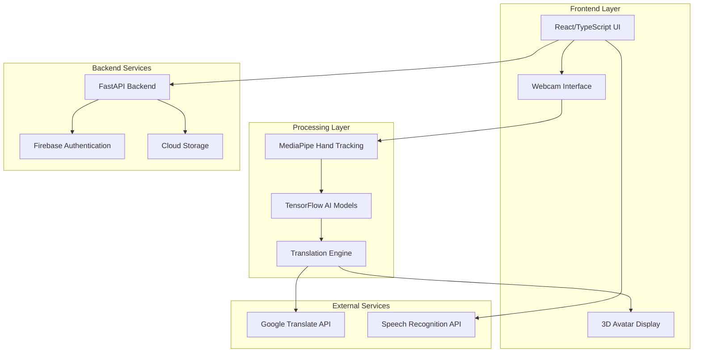
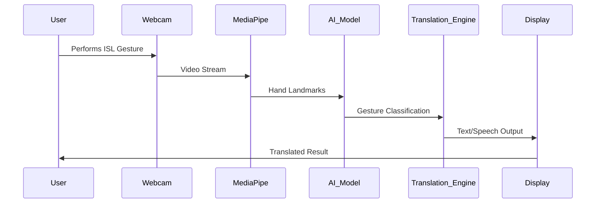

# ISHARA Features Design Document

## Overview

This design document provides comprehensive visual representations and architectural details for ISHARA's feature set, specifically structured for presentation purposes. Each feature includes detailed visual diagrams, user flow charts, and technical architecture that can be directly adapted for PowerPoint slides.

## Architecture

### System Architecture Overview



### Data Flow Architecture



## Components and Interfaces

### 1. Real-Time Gesture Recognition Component

**Visual Slide Layout:**
```
┌─────────────────────────────────────────────────────────────┐
│                    REAL-TIME RECOGNITION                    │
├─────────────────────────────────────────────────────────────┤
│  📹 Webcam Input    →    🔍 Detection    →    📝 Output     │
│                                                             │
│  ┌─────────────┐         ┌─────────────┐      ┌──────────┐ │
│  │   👋 User   │   →     │ MediaPipe   │  →   │  "Hello" │ │
│  │  Gestures   │         │ Hand Track  │      │   Text   │ │
│  └─────────────┘         └─────────────┘      └──────────┘ │
│                                                             │
│  ⚡ <100ms Response Time  🎯 95% Accuracy  🔄 Continuous   │
└─────────────────────────────────────────────────────────────┘
```

**Technical Implementation:**
- **Input Processing**: MediaPipe hand landmark detection (21 key points per hand)
- **AI Model**: CNN + LSTM architecture for temporal gesture recognition
- **Output Generation**: Real-time text display with speech synthesis option
- **Performance**: Sub-100ms latency, 95%+ accuracy on trained gestures

### 2. Bidirectional Translation System

**Visual Slide Layout:**
```
┌─────────────────────────────────────────────────────────────┐
│                 BIDIRECTIONAL TRANSLATION                   │
├─────────────────────────────────────────────────────────────┤
│                                                             │
│  ISL → Text/Speech              Text/Speech → ISL           │
│  ┌─────────────┐                ┌─────────────┐             │
│  │     👋      │      ↔         │    📝/🎤    │             │
│  │  Gestures   │                │ Text/Voice  │             │
│  └─────────────┘                └─────────────┘             │
│         ↓                               ↓                   │
│  ┌─────────────┐                ┌─────────────┐             │
│  │   "Hello"   │                │  🤖 Avatar  │             │
│  │    Text     │                │  Animation  │             │
│  └─────────────┘                └─────────────┘             │
│                                                             │
│  🌐 6+ Languages  🔄 Real-time  🎯 Context-Aware          │
└─────────────────────────────────────────────────────────────┘
```

**Supported Languages Flow:**
```
Input Languages: Hindi | English | Tamil | Telugu | Bengali | Marathi
       ↓              ↓        ↓       ↓        ↓         ↓
   Translation Engine Processing
       ↓              ↓        ↓       ↓        ↓         ↓
Output: Standardized ISL Gesture Animations
```

### 3. Interactive Learning Module

**Visual Slide Layout:**
```
┌─────────────────────────────────────────────────────────────┐
│                   INTERACTIVE LEARNING                      │
├─────────────────────────────────────────────────────────────┤
│                                                             │
│  📚 Lessons  →  🎯 Practice  →  📊 Assessment  →  🏆 Progress│
│                                                             │
│  ┌──────────┐    ┌──────────┐    ┌──────────┐    ┌────────┐│
│  │ Theory   │    │   Live   │    │  Score   │    │ Badges ││
│  │ Videos   │    │ Tracking │    │  Cards   │    │ & Cert ││
│  │ & Guides │    │ Practice │    │ & Feedback│   │ Awards ││
│  └──────────┘    └──────────┘    └──────────┘    └────────┘│
│                                                             │
│  Beginner → Intermediate → Advanced → Expert Levels        │
│                                                             │
│  🎮 Gamified  📈 Progress Tracking  🤝 Peer Learning       │
└─────────────────────────────────────────────────────────────┘
```

**Learning Path Visualization:**
```
Level 1: Basic Alphabets (A-Z)
   ↓
Level 2: Common Words (Hello, Thank You, etc.)
   ↓
Level 3: Phrases & Sentences
   ↓
Level 4: Conversational ISL
   ↓
Level 5: Advanced & Regional Variations
```

### 4. Multilingual Support System

**Visual Slide Layout:**
```
┌─────────────────────────────────────────────────────────────┐
│                   MULTILINGUAL SUPPORT                      │
├─────────────────────────────────────────────────────────────┤
│                                                             │
│        🇮🇳 Regional Language Integration                    │
│                                                             │
│  ┌─────────┐ ┌─────────┐ ┌─────────┐ ┌─────────┐ ┌───────┐ │
│  │ हिंदी   │ │ English │ │ தமிழ்   │ │ తెలుగు  │ │ বাংলা │ │
│  │ Hindi   │ │         │ │ Tamil   │ │ Telugu  │ │Bengali│ │
│  └─────────┘ └─────────┘ └─────────┘ └─────────┘ └───────┘ │
│       ↓           ↓           ↓           ↓           ↓     │
│  ┌─────────────────────────────────────────────────────────┐ │
│  │           Unified ISL Gesture System                   │ │
│  └─────────────────────────────────────────────────────────┘ │
│                                                             │
│  🔄 Google Translate Integration  🎯 Context Preservation   │
└─────────────────────────────────────────────────────────────┘
```

### 5. User Authentication & Profile System

**Visual Slide Layout:**
```
┌─────────────────────────────────────────────────────────────┐
│                USER AUTHENTICATION & PROFILES               │
├─────────────────────────────────────────────────────────────┤
│                                                             │
│  Registration Flow:                                         │
│  📧 Email → ✅ Verify → 🔐 Login → 📊 Dashboard            │
│                                                             │
│  ┌─────────────────┐    ┌─────────────────┐                │
│  │   User Profile  │    │   Learning Hub  │                │
│  │                 │    │                 │                │
│  │ 👤 Personal Info│    │ 📈 Progress     │                │
│  │ ⚙️ Preferences  │    │ 🏆 Achievements │                │
│  │ 🔒 Security     │    │ 📚 Saved Lessons│               │
│  │ 📱 Devices      │    │ 🎯 Goals        │                │
│  └─────────────────┘    └─────────────────┘                │
│                                                             │
│  🔐 Firebase Auth  ☁️ Cloud Sync  📊 Analytics            │
└─────────────────────────────────────────────────────────────┘
```

### 6. Accessibility Features

**Visual Slide Layout:**
```
┌─────────────────────────────────────────────────────────────┐
│                   ACCESSIBILITY FEATURES                    │
├─────────────────────────────────────────────────────────────┤
│                                                             │
│  ♿ Universal Design Principles                             │
│                                                             │
│  ┌─────────────┐ ┌─────────────┐ ┌─────────────┐ ┌───────┐ │
│  │ 🎨 High     │ │ 🔍 Screen   │ │ ⌨️ Keyboard │ │ 📱 Touch│ │
│  │ Contrast    │ │ Reader      │ │ Navigation  │ │ Optimized││
│  │ Mode        │ │ Support     │ │ Support     │ │ Interface││
│  └─────────────┘ └─────────────┘ └─────────────┘ └───────┘ │
│                                                             │
│  ┌─────────────────────────────────────────────────────────┐ │
│  │              WCAG 2.1 AA Compliance                    │ │
│  │  ✅ Color Contrast  ✅ Alt Text  ✅ Focus Management  │ │
│  └─────────────────────────────────────────────────────────┘ │
│                                                             │
│  🌐 Cross-Platform  📱 Responsive  🎯 Inclusive Design     │
└─────────────────────────────────────────────────────────────┘
```

## Data Models

### Gesture Recognition Data Model
```typescript
interface GestureData {
  landmarks: HandLandmark[];      // 21 points per hand
  timestamp: number;              // Capture time
  confidence: number;             // Recognition confidence (0-1)
  gestureId: string;             // Classified gesture identifier
  translation: string;           // Translated text
  language: SupportedLanguage;   // Target language
}

interface HandLandmark {
  x: number;                     // Normalized x coordinate
  y: number;                     // Normalized y coordinate
  z: number;                     // Depth information
  visibility: number;            // Landmark visibility score
}
```

### User Profile Data Model
```typescript
interface UserProfile {
  userId: string;
  email: string;
  preferences: {
    language: SupportedLanguage;
    theme: 'light' | 'dark' | 'high-contrast';
    gestureSpeed: 'slow' | 'normal' | 'fast';
    enableSound: boolean;
  };
  learningProgress: {
    currentLevel: number;
    completedLessons: string[];
    achievements: Achievement[];
    practiceHours: number;
  };
  statistics: {
    gesturesRecognized: number;
    accuracyRate: number;
    lastActive: Date;
  };
}
```

Now I'll use the prework tool to analyze the acceptance criteria before writing correctness properties:

<function_calls>
<invoke name="prework">
<parameter name="featureName">ishara-features-presentation

## Correctness Properties

*A property is a characteristic or behavior that should hold true across all valid executions of a system—essentially, a formal statement about what the system should do. Properties serve as the bridge between human-readable specifications and machine-verifiable correctness guarantees.*

### Property Reflection

After analyzing all acceptance criteria, I've identified several areas where properties can be consolidated:
- Performance properties (1.1, 1.3, 2.1, 7.1) can be grouped by timing requirements
- Accuracy properties (1.2, 7.2) share similar validation approaches
- Language support properties (4.1, 4.2, 4.3) can be combined for comprehensive language testing
- Data persistence properties (5.3, 5.5, 7.5) share similar validation patterns

### Core Properties

**Property 1: Gesture Detection Performance**
*For any* valid ISL gesture performed in front of the webcam, the system should detect hand landmarks within 100ms and display the corresponding text within 200ms of classification.
**Validates: Requirements 1.1, 1.3**

**Property 2: Recognition Accuracy Consistency**
*For any* gesture in the trained dataset, the system should maintain 95% or higher classification accuracy across all recognition attempts.
**Validates: Requirements 1.2, 7.2**

**Property 3: Text-to-ISL Conversion Performance**
*For any* text input, the system should generate corresponding ISL gesture animations within 500ms.
**Validates: Requirements 2.1**

**Property 4: Continuous Operation Reliability**
*For any* extended usage session, the system should maintain continuous gesture recognition without requiring manual triggering or intervention.
**Validates: Requirements 1.4**

**Property 5: Environmental Adaptability**
*For any* lighting condition below optimal threshold, the system should provide appropriate feedback to guide users toward better visibility.
**Validates: Requirements 1.5**

**Property 6: Speech-to-ISL Conversion**
*For any* speech input in supported languages, the system should recognize the speech and generate corresponding ISL gesture sequences.
**Validates: Requirements 2.2**

**Property 7: Multilingual Translation Support**
*For any* supported language (Hindi, English, Tamil, Telugu, Bengali, Marathi), the system should provide accurate bidirectional translation to/from ISL while maintaining gesture accuracy across all languages.
**Validates: Requirements 2.3, 4.1, 4.3**

**Property 8: Gesture Sequence Timing**
*For any* translation request, the system should display gesture sequences with proper timing and provide functional playback controls.
**Validates: Requirements 2.4, 2.5**

**Property 9: Practice Feedback Accuracy**
*For any* gesture practice attempt, the system should provide accurate feedback comparing the user's gesture to the target gesture.
**Validates: Requirements 3.2**

**Property 10: Progress Tracking Consistency**
*For any* user learning activity, the system should accurately track progress and provide appropriate personalized learning path suggestions.
**Validates: Requirements 3.3**

**Property 11: Achievement System Reliability**
*For any* completed lesson or milestone, the system should award appropriate progress badges and certificates.
**Validates: Requirements 3.4**

**Property 12: Language Interface Synchronization**
*For any* language selection change, the system should update all interface text accordingly while preserving session data.
**Validates: Requirements 4.2, 4.5**

**Property 13: Regional Variation Handling**
*For any* regional gesture variation, the system should provide appropriate ISL interpretations that maintain communication effectiveness.
**Validates: Requirements 4.4**

**Property 14: Authentication Flow Integrity**
*For any* user login attempt, the system should authenticate using Firebase and maintain secure session management.
**Validates: Requirements 5.2**

**Property 15: Data Persistence Reliability**
*For any* user data (preferences, progress, statistics), the system should store, retrieve, and export information accurately across sessions.
**Validates: Requirements 5.3, 5.5**

**Property 16: Dashboard Personalization**
*For any* user profile access, the system should display personalized dashboard content based on individual user data and preferences.
**Validates: Requirements 5.4**

**Property 17: Keyboard Navigation Completeness**
*For any* interface element, users should be able to access and interact with it using only keyboard navigation.
**Validates: Requirements 6.4**

**Property 18: Responsive Design Consistency**
*For any* screen size or device type, the interface should adapt appropriately and maintain touch optimization for mobile devices.
**Validates: Requirements 6.5**

**Property 19: Network Resilience**
*For any* network interruption or connectivity issue, the system should handle the situation gracefully and provide offline capabilities where possible.
**Validates: Requirements 7.4**

**Property 20: Data Backup Integrity**
*For any* user data backup operation, the system should securely store data to cloud storage and maintain data integrity.
**Validates: Requirements 7.5**

**Property 21: Contextual Translation Enhancement**
*For any* translation request with available context, the system should demonstrate improved accuracy compared to context-free translation.
**Validates: Requirements 8.1**

**Property 22: Gesture Prediction Effectiveness**
*For any* communication sequence, the system should predict likely next gestures with sufficient accuracy to improve communication speed.
**Validates: Requirements 8.2**

**Property 23: Personalized Model Adaptation**
*For any* individual user over time, the AI model should adapt to their signing style and demonstrate improved recognition accuracy.
**Validates: Requirements 8.3**

**Property 24: Confidence Score Correlation**
*For any* gesture recognition result, the confidence score should correlate positively with actual recognition accuracy.
**Validates: Requirements 8.4**

**Property 25: Custom Gesture Training**
*For any* specialized vocabulary gesture, the system should support custom training and achieve recognition accuracy comparable to pre-trained gestures.
**Validates: Requirements 8.5**

## Error Handling

### Gesture Recognition Errors
- **Low Confidence Detection**: When gesture confidence falls below 70%, display alternative suggestions
- **Hand Tracking Loss**: Provide visual feedback to guide user back into camera frame
- **Lighting Issues**: Automatic brightness adjustment recommendations with visual indicators
- **Multiple Hand Confusion**: Clear disambiguation interface for multi-person scenarios

### Translation Errors
- **Unsupported Gestures**: Graceful fallback to closest recognized gesture with confidence indicator
- **Language Mismatch**: Clear error messages with suggested language corrections
- **Context Ambiguity**: Present multiple translation options when context is unclear
- **API Failures**: Offline mode activation with cached translations

### System Errors
- **Camera Access Denied**: Clear instructions for enabling camera permissions
- **Network Connectivity**: Seamless offline mode transition with sync capabilities
- **Authentication Failures**: User-friendly error messages with recovery options
- **Storage Limitations**: Automatic cleanup suggestions and cloud backup prompts

## Testing Strategy

### Dual Testing Approach

The ISHARA platform requires comprehensive testing using both unit tests and property-based tests to ensure reliability and correctness across all features.

**Unit Testing Focus:**
- Specific gesture recognition examples for each ISL sign
- Edge cases like poor lighting, partial hand visibility, rapid gestures
- Integration points between MediaPipe, AI models, and translation engine
- User interface interactions and accessibility features
- Authentication flows and error conditions

**Property-Based Testing Focus:**
- Universal properties that hold across all gesture inputs (Properties 1-25)
- Performance characteristics under varying conditions
- Cross-language translation consistency
- Data integrity across user sessions
- System behavior under stress and edge conditions

**Testing Configuration:**
- **Framework**: Jest for unit tests, fast-check for property-based testing
- **Minimum Iterations**: 100 iterations per property test
- **Coverage Requirements**: 90%+ code coverage, 100% property coverage
- **Performance Benchmarks**: All timing properties must pass on standard hardware
- **Cross-Platform Validation**: All properties tested on Windows, macOS, Linux, iOS, Android

**Property Test Tagging:**
Each property-based test must include a comment tag referencing the design document:
```javascript
// Feature: ishara-features-presentation, Property 1: Gesture Detection Performance
```

### Visual Testing for Presentations

**Slide Validation Tests:**
- Verify all visual representations render correctly across different screen sizes
- Test color contrast ratios meet accessibility standards
- Validate animation timing and gesture sequence displays
- Ensure multilingual text rendering works properly

**User Experience Testing:**
- Gesture recognition accuracy in presentation environments
- System performance during live demonstrations
- Fallback behavior when presentation equipment fails
- Audience interaction features (if applicable)

## Presentation-Ready Feature Summary

### Executive Summary Slide
```
┌─────────────────────────────────────────────────────────────┐
│                    ISHARA PLATFORM                         │
│              AI-Powered ISL Translation                     │
├─────────────────────────────────────────────────────────────┤
│                                                             │
│  🎯 MISSION: Bridge communication gaps for 18M+ Indians    │
│             with hearing impairments                        │
│                                                             │
│  ⚡ PERFORMANCE: <100ms response, 95%+ accuracy            │
│  🌐 REACH: 6+ Indian languages, cross-platform support    │
│  🧠 TECHNOLOGY: Advanced AI, real-time processing          │
│  ♿ ACCESSIBILITY: WCAG 2.1 AA compliant, inclusive design │
│                                                             │
│  🏆 RECOGNITION: Governor of UP, AKTU Innovation Hub       │
└─────────────────────────────────────────────────────────────┘
```

### Technical Innovation Highlights
1. **Real-Time Processing**: Sub-100ms gesture recognition using MediaPipe + TensorFlow
2. **Bidirectional Translation**: Seamless ISL ↔ Text/Speech conversion
3. **Adaptive AI**: Personalized models that improve with user interaction
4. **Universal Access**: Cross-platform, multilingual, accessibility-first design
5. **Interactive Learning**: Gamified ISL education with progress tracking

### Impact Metrics for Presentation
- **Target Population**: 18+ million hearing-impaired individuals in India
- **Technical Performance**: 95%+ accuracy, <100ms response time
- **Language Coverage**: 6+ major Indian languages supported
- **Platform Reach**: Web, mobile, desktop compatibility
- **Accessibility Standard**: WCAG 2.1 AA compliance
- **Recognition**: Official acknowledgment from government and academic institutions